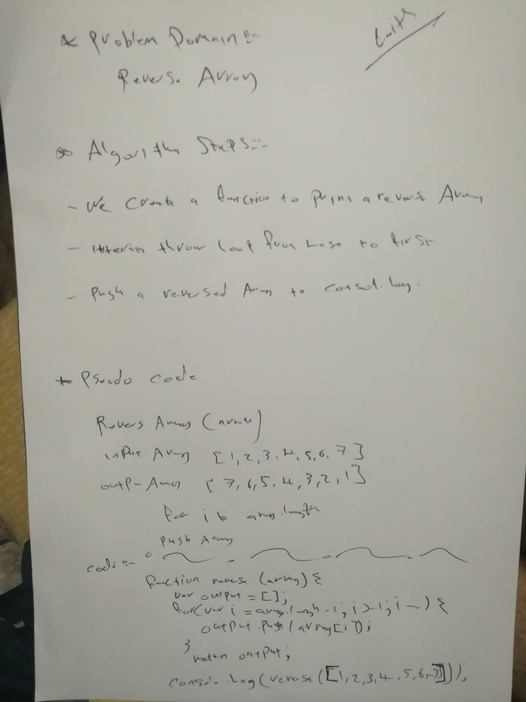

# data-structures-and-algorithms

# Reverse an Array
 a function called reverseArray which takes an array as an argument. Without utilizing any of the built-in methods and return an array with elements in reversed order.

## Challenge
<!-- Description of the challenge -->
we write a function to print an array in reverse 

## Approach & Efficiency
<!-- What approach did you take? Why? What is the Big O space/time for this approach? -->

## Solution
<!-- Embedded whiteboard image -->

