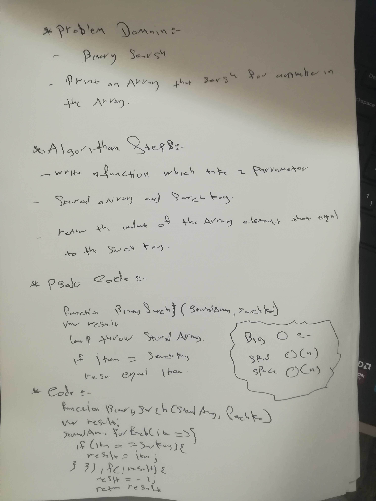

# data-structures-and-algorithms

# BinarySearch

Write a function called BinarySearch which takes in 2 parameters: a sorted array and the search key. Without utilizing any of the built-in methods available to your language, return the index of the array’s element that is equal to the search key, or -1 if the element
## Challenge
<!-- Description of the challenge -->
we write a function to search for  a number in the  array 

## Approach & Efficiency
<!-- What approach did you take? Why? What is the Big O space/time for this approach? -->
this Challenge take from me 20 min including tow ways to do that
I used in the first way for loop
and in the other way I used some mathhimatical logic to do so
## Action Link 

[https://github.com/laith-401-advanced-javascript/data-structures-and-algorithms/actions/runs/243515245]

(https://github.com/laith-401-advanced-javascript/data-structures-and-algorithms/actions/runs/243515245)

## Solution
<!-- Embedded whiteboard image -->

