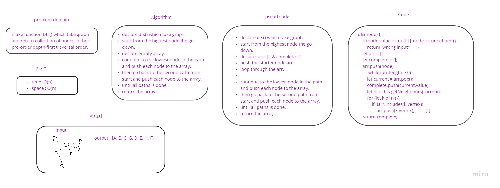

# Graph
consists of a finite (and possibly mutable) set of vertices (also called nodes or points), together with a set of unordered pairs of these vertices for an undirected graph or a set of ordered pairs for a directed graph.

## Challenge
* Create a function that accepts an adjacency list as a graph, and conducts a depth first traversal. Without utilizing any of the built-in methods available to your language, return a collection of nodes in their pre-order depth-first traversal order..

## Approach & Efficiency

using ES6 classes, definning a class for Vertex, a class for edges, and a class for the graph which uses JS Map()

## board:

