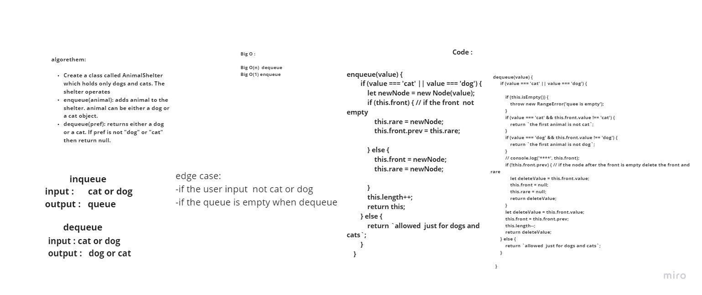

# data-structures-and-algorithms

# fifo animal shelter  :
Create a class called AnimalShelter which holds only dogs and cats. The shelter operates using a first-in, first-out approach.

## Challenge
enqueue(animal): adds animal to the shelter. animal can be either a dog or a cat object.
dequeue(pref): returns either a dog or a cat. If pref is not "dog" or "cat" then return null.

## Approach & Efficiency
<!-- What approach did you take? Why? What is the Big O space/time for this approach? -->
Create a animal class that has  It creates an cat or dog animal when the user enter..

## Solution

## Action Link 
[ Action Link]

(https://github.com/laith-401-advanced-javascript/data-structures-and-algorithms/actions/runs/250446381)