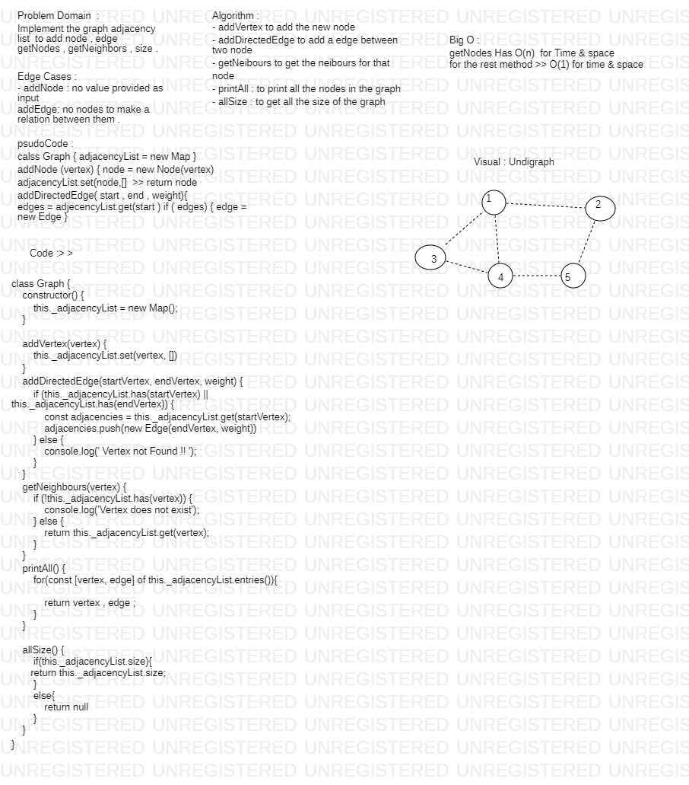

# Graph 

# Whiteboeard

# problem Domain  & Algorithm :

Implement your own Graph. The graph should be represented as an adjacency list, and should include the following methods:

### AddNode()

 1- Adds a new node to the graph
 2- Takes in the value of that node
 
### AddEdge()

 1- Adds a new edge between two nodes in the graph
 2- Include the ability to have a “weight”
 3- Takes in the two nodes to be connected by the edge
 4- Both nodes should already be in the Graph

### GetNodes()

 1- Returns all of the nodes in the graph as a collection (set, list, or similar)

### GetNeighbors()

 1- Returns a collection of edges connected to the given node
 2- Takes in a given node
 3- Include the weight of the connection in the returned collection

### Size()

 1- Returns the total number of nodes in the graph

## Approach & Efficiency

this Challenge take from me 50 min to do tha

## Big O:

- **Time** O(1) >> because it is a adjecency list type 
- **space** O(1) >>  because it is a adjecency list type  

## Action Link

[ Action Link]

(https://github.com/laith-401-advanced-javascript/data-structures-and-algorithms/actions/runs/250446381)

# whiteboard 

 