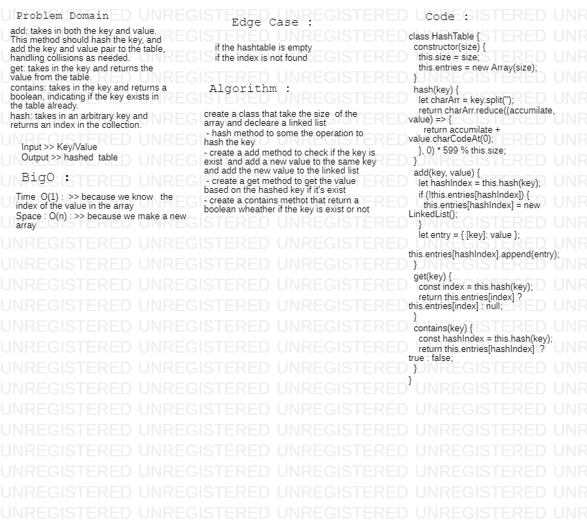

# data-structures-and-algorithms

# hashTable
Hash - A hash is the result of some algorithm taking an incoming string and converting it into a value that could be used for either security or some other purpose. In the case of a hashtable, it is used to determine the index of the array.
Buckets - A bucket is what is contained in each index of the array of the hashtable. Each index is a bucket. An index could potentially contain multiple key/value pairs if a collision occurs.
Collisions - A collision is what happens when more than one key gets hashed to the same location of the hashtable.

## Challenge
<!-- Description of the challenge -->
we want to be able to search through the data to look up a neighborhood and obtain it’s zip code. We could do this using a for loop that looks through each piece of data one by one until it

## Approach & Efficiency
<!-- What approach did you take? Why? What is the Big O space/time for this approach? -->
this Challenge take from me 50 min  to do tha

Big O  :

Time  O(1) :  >> because we know   the index of the value in the array 
Space : O(n) : >> because we make a new array 

## Action Link 

[ Action Link]

(https://github.com/laith-401-advanced-javascript/data-structures-and-algorithms/actions/runs/243524335)

## Solution
<!-- Embedded whiteboard image -->

