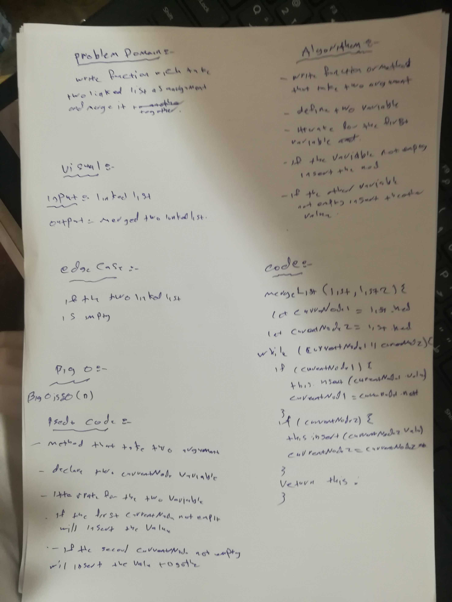

# data-structures-and-algorithms

# linked list

Write a function called zipLists which takes two linked lists as arguments. Zip the two linked lists together into one so that the nodes alternate between the two lists and return a reference to the head of the zipped list. Try and keep additional space down to O(1). You have access to the Node class and all the properties on the Linked List class as well as the methods created in previous challenges.
## Challenge
<!-- Description of the challenge -->
merge two linked list togother

## Approach & Efficiency
<!-- What approach did you take? Why? What is the Big O space/time for this approach? -->
this Challenge take from me 60 min  to do tha

## Action Link 

[ Action Link]

(https://github.com/laith-401-advanced-javascript/data-structures-and-algorithms/actions/runs/250446381)

## Solution
<!-- Embedded whiteboard image -->

