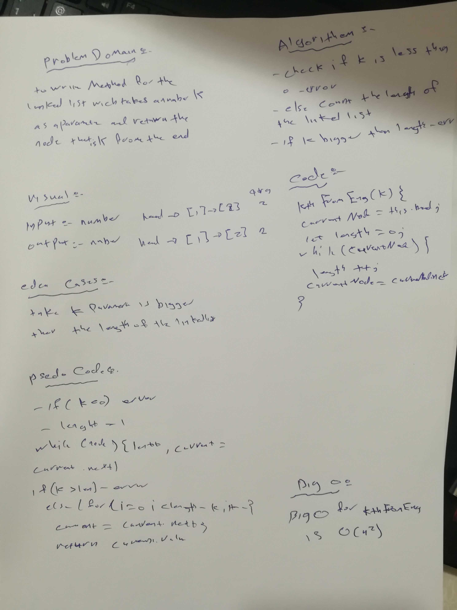

# data-structures-and-algorithms

# linked list

Write a method for the Linked List class which takes a number, k, as a parameter. Return the node’s value that is k from the end of the linked list. You have access to the Node class and all the properties on the Linked List class as well as the methods created in previous challenges.
## Challenge
<!-- Description of the challenge -->
we write a classes to add a linked list

## Approach & Efficiency
<!-- What approach did you take? Why? What is the Big O space/time for this approach? -->
this Challenge take from me 60 min  to do tha

## Action Link 

[ Action Link]

(https://github.com/laith-401-advanced-javascript/data-structures-and-algorithms/actions/runs/250446381)

## Solution
<!-- Embedded whiteboard image -->

