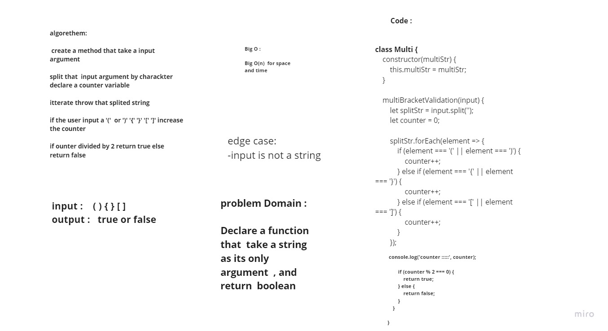

# data-structures-and-algorithms

# Multi Bracket Validation

Write a function called zipLists which takes two linked lists as arguments. Zip the two linked lists together into one so that the nodes alternate between the two lists and return a reference to the head of the zipped list. Try and keep additional space down to O(1). You have access to the Node class and all the properties on the Linked List class as well as the methods created in previous challenges.
## Challenge
<!-- Description of the challenge -->
Declare a function that should take a string as its only argument, and should return a boolean representing whether or not the brackets in the string are balanced. There are 3 types of brackets:

Round Brackets : ()
Square Brackets : []
Curly Brackets : {}

## Approach & Efficiency
<!-- What approach did you take? Why? What is the Big O space/time for this approach? -->
create a stack as a helper data structure within this function because stacks use a LIFO model: when a closing bracket is encountered reading left to right, the first out of the stack of preceding opening brackets should always be its match.

examples and why they fail:

| Input | 	Output |	Why |
|-------|----------|--------|
| `{` |	FALSE |	error unmatched opening { remaining. |
| `)` |	FALSE |	error closing ) arrived without corresponding opening. |
| `[}` | FALSE |	error closing }. Doesn’t match opening (. |

## Action Link 

[ Action Link]

(https://github.com/laith-401-advanced-javascript/data-structures-and-algorithms/actions/runs/250446381)

## Solution
<!-- Embedded whiteboard image -->

