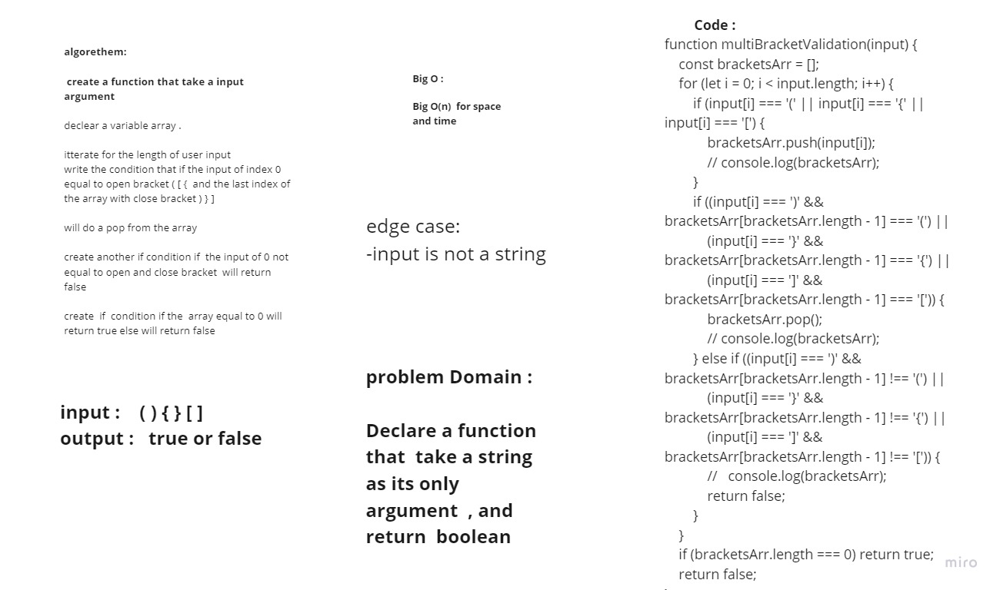

# data-structures-and-algorithms

# Multi Bracket Validation

Your function should take a string as its only argument, and should return a boolean representing whether or not the brackets in the string are balanced. There are 3 types of brackets:

Round Brackets : ()
Square Brackets : []
Curly Brackets : {}

## Challenge
<!-- Description of the challenge -->
will create a funtion to check if the user input open and the close of the bracket  

## Approach & Efficiency
<!-- What approach did you take? Why? What is the Big O space/time for this approach? -->

using a forEach to iterate the string and check for the brackets,
if statements to test Regex with character
if statement true push character to stack

## Action Link 

[ Action Link]

(https://github.com/laith-401-advanced-javascript/data-structures-and-algorithms/actions/runs/250446381)

## Solution
<!-- Embedded whiteboard image -->

