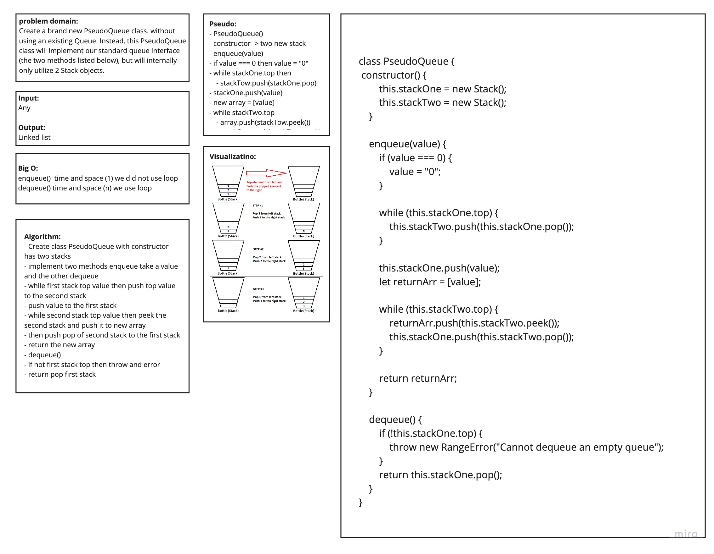

# data-structures-and-algorithms

# Queue with Stack  :
this code will create a **Queue** usibg two **Stack** , **PseudoQueue** class will create the standard **queue** interface .

## Challenge
Create a brand new `PseudoQueue` class. Do not use an existing `Queue`. Instead, this PseudoQueue class will implement our standard queue interface (the two methods listed below), but will internally only utilize **2** Stack objects. Ensure that you create your class with the following methods: `enqueue(value)` , `dequeue()`

## Approach & Efficiency
<!-- What approach did you take? Why? What is the Big O space/time for this approach? -->
Create a Stack class that has a top property. It creates an empty Stack when instantiated..

#### Big O:

- the **Big O** is **O**(1) for bothe **space** and **time**, for `dequeue`
- the **Big O** is **O**(n) for bothe **space** and **time**, for `enqueue`

## Solution

## Action Link 

[ Action Link]

(https://github.com/laith-401-advanced-javascript/data-structures-and-algorithms/actions/runs/250446381)