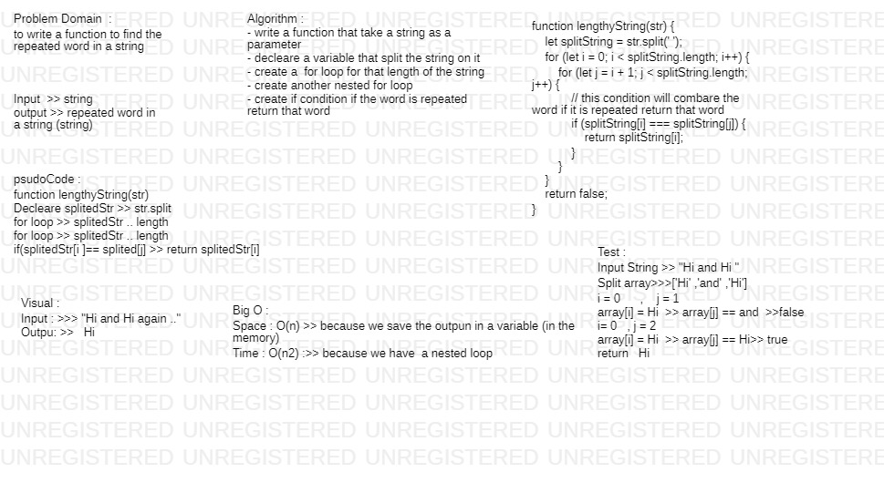

# lengthyString

# Feature Tasks

Write a function that accepts a lengthy string parameter.
Without utilizing any of the built-in library methods available to your language, return the first word to occur more than once in that provided string.

## Challenge
we have to create nested for loop to search for a string and find the similar charachter 

## Approach & Efficiency
<!-- What approach did you take? Why? What is the Big O space/time for this approach? -->
this Challenge take from me 50 min to do tha

#### Big O:

- **Time** O(n2) 
- **space** O(n)

## Action Link 

[ Action Link]

(https://github.com/laith-401-advanced-javascript/data-structures-and-algorithms/actions/runs/250446381)

## Solution

