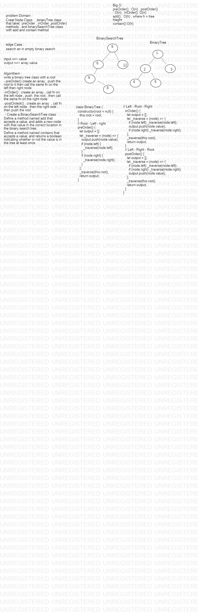

# data-structures-and-algorithms

# Tree   :

in this challenge we do the tree and BST  , and these two type of data structure 

Node
The Node class is a new class that has properties for the value stored in the node, the left child node, and the right child node.

Binary Tree
A BinaryTree class that has a method for each of the depth first traversals called preOrder, inOrder, and postOrder which returns an array of the values, ordered appropriately.

Binary Search Tree
A BinarySearchTree class, it has a method named add that accepts a value, and adds a new node with that value in the correct location in the binary search tree. It also has a method named contains that accepts a value, and returns a boolean indicating whether or not the value is in the tree at least once.

## Challenge
Create a Node class that has properties for the value stored in the node, the left child node, and the right child node.
Create a BinaryTree class
Define a method for each of the depth first traversals called preOrder, inOrder, and postOrder which returns an array of the values, ordered appropriately.

## Approach & Efficiency
<!-- What approach did you take? Why? What is the Big O space/time for this approach? -->
this Challenge take from me 60 min  to do it ,
i used node stack , binary tree m binary search classes to do  it  

preOrder(): O(n)
inOrder(): O(n)
postOrder(): O(n)

## Action Link 
[ Action Link]

(https://github.com/laith-401-advanced-javascript/data-structures-and-algorithms/actions/runs/250446381)

## Solution

